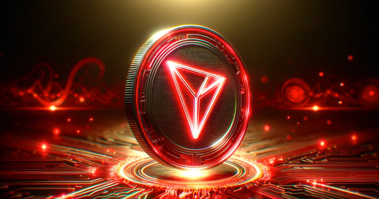

안녕하세요

암호화폐(해외에서 크립토)중 트론을 들어 보신 적 있으신가요?

트론코인은 탈중앙화된 프로토콜이자 블록체인 기술을 활용하여 탈중앙화된 인터넷을 구축하는 것을 목표로 하는 트론(TRON)의 네이티브 암호화폐입니다.

**TRON의 주요 특징**

1. **높은 처리 속도**: TRON 네트워크는 초당 수천 건의 트랜잭션(TPS)을 처리할 수 있어, 비트코인이나 이더리움보다 훨씬 빠른 처리 속도를 자랑합니다.
2. **낮은 수수료**: TRON은 트랜잭션 수수료가 매우 낮거나 아예 없는 경우도 많습니다.
3. **확장성**: TRON 네트워크는 확장성이 뛰어나며, 대규모의 사용자와 트랜잭션을 처리할 수 있습니다.
4. **스마트 계약**: TRON은 이더리움과 마찬가지로 스마트 계약을 지원하여 다양한 분산 애플리케이션(DApps)을 구축할 수 있습니다.
5. **TRON 가상 머신(TVM)**: TRON 가상 머신은 이더리움 가상 머신(EVM)과 호환되어, 이더리움에서 사용되던 DApp을 TRON으로 쉽게 이전할 수 있습니다.

